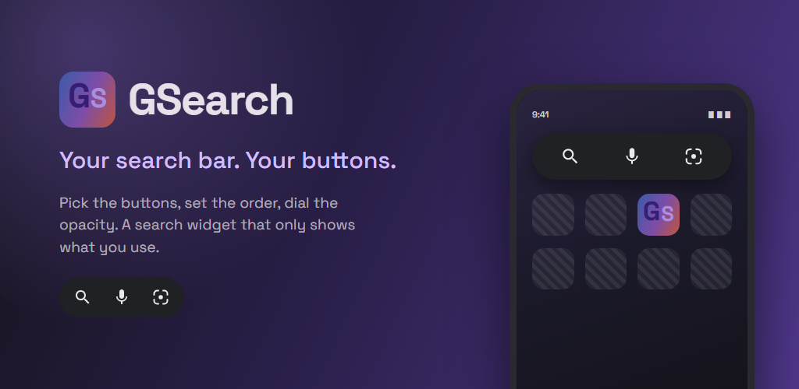
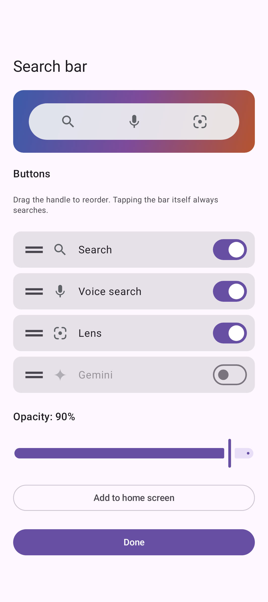
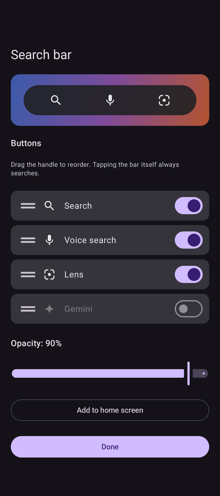
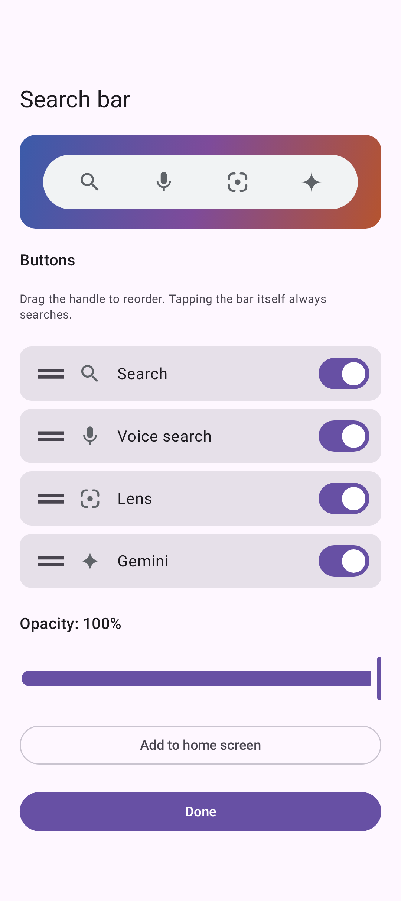

# GSearch

[](https://github.com/MS-Mobile/GSearch/actions/workflows/pull-request-build.yml)



An Android home screen widget that replaces the stock Google search bar with one you
choose the buttons for. Pick which of Search, Voice search, Lens and Gemini appear, drag
them into the order you want, set how see-through the pill is — and nothing else. The app
declares no permissions at all, makes no network call of its own, and stores nothing beyond
those preferences.

The settings screen doubles as the app: it opens from the launcher icon and from the
widget's own long-press menu, and every edit saves and re-renders the widget immediately.

## Screenshots

|                                    Settings — light                                    |                                   Settings — dark                                    |                                     All four buttons                                      |
|:--------------------------------------------------------------------------------------:|:------------------------------------------------------------------------------------:|:-------------------------------------------------------------------------------------------:|
|  |  |  |

The widget itself, at the default three buttons and at all four:

|  |
|:-----------------------------------------------------------------------------------------------------:|
|  |

Every image above is a Compose screenshot-test reference render, not a hand-taken capture —
see [Screenshots and the gallery](#screenshots-and-the-gallery).

## What the buttons do

Each button fires one intent, pinned to a package. The implicit forms are ambiguous on real
devices — Chrome competes for `WEB_SEARCH`, any installed assistant competes for `ASSIST` —
so unpinned they would show a chooser.

| Button | Opens | Intent |
| --- | --- | --- |
| **Search** | The Google search input | `SearchManager.INTENT_ACTION_GLOBAL_SEARCH` → Google app |
| **Voice search** | The listening screen | `android.intent.action.VOICE_ASSIST` → Google app |
| **Lens** | Standalone Lens, else its Play listing, else search | resolved at bind time |
| **Gemini** | Gemini chat in its floating pill | `RecognizerIntent.ACTION_WEB_SEARCH` → Google app |

Two of these are counterintuitive enough to be worth stating before someone "fixes" them:
`VOICE_ASSIST` gives plain voice search while `ACTION_WEB_SEARCH` gives Gemini — inverted
relative to what the constant names imply — and there is deliberately no direct Lens intent,
because the one the Google widget uses is not exported and the `google://lens` variants
resolve, report success, and silently do nothing.

Each intent was verified by real launch on a device. What was tried and what failed is in
[`docs/superpowers/findings/2026-08-06-search-intents.md`](docs/superpowers/findings/2026-08-06-search-intents.md).

## Tech stack

- **Language:** Kotlin
- **Widget:** Jetpack Glance (`GlanceAppWidget`), state in Glance's own DataStore
- **Settings UI:** Jetpack Compose with Material 3, single Activity, no view model — the
  screen holds its own state
- **Storage:** SharedPreferences. One global configuration, not one per widget id
- **Tests:** JUnit unit tests plus Compose screenshot tests (`validateDebugScreenshotTest`)
- **Static analysis:** Spotless/ktlint (with compose-rules), detekt, Android lint with
  `warningsAsErrors`

No DI framework, no database, no network layer — the app is small enough that adding any of
them would cost more than it saves.

## Requirements

- Android Studio (AGP 9.4)
- JDK 17 or newer
- Android SDK 37 (minimum SDK 26)

## Getting started

1. Clone the repository
2. Open the project in Android Studio
3. Sync Gradle dependencies
4. `./gradlew installDebug`, then long-press the home screen → Widgets → GSearch

Debug builds install as `com.msmobile.gsearch.debug` with a **DEV** ribbon on the icon, so
they sit alongside a release install.

## Project structure

```
com.msmobile.gsearch/
├── config/             # Settings screen (Compose, Material 3)
│   ├── ConfigActivity.kt          # Launcher entry + the widget's `android:configure` target
│   ├── ConfigScreen.kt            # Switches, drag-to-reorder, opacity slider, pin-to-home
│   └── *PreviewConfigProvider.kt  # The states pinned to screenshot references
├── intents/
│   └── SearchIntents.kt           # The verified intents, including what does not work
├── utils/
│   └── PreviewPhone.kt            # Device + light/dark the previews render at
└── widget/
    ├── GSearchWidgetProvider.kt   # GlanceAppWidgetReceiver; name is the widget's identity
    ├── GSearchGlanceWidget.kt     # The bar, composed
    ├── GSearchBar.kt              # The pill itself, drawn through the PreviewCompat shims
    ├── PreviewCompat*.kt          # Glance stand-ins so previews can render the same tree
    ├── WidgetAction.kt            # One enum entry per thing the widget can do
    ├── WidgetActionActivity.kt    # Invisible hop between a button and the app it opens
    ├── WidgetConfig.kt            # Enabled actions, their order, opacity
    └── WidgetRefresh.kt           # Process-lifetime scope that pushes edits to placed widgets
```

Two of those names carry constraints that are not obvious from the outside:

- **`GSearchWidgetProvider`** must keep its class name. It is what the launcher records for
  every widget already on a home screen, so renaming it orphans them.
- **`WidgetAction`** constant names are the persisted format. Renaming one breaks existing
  configurations.

## Development

```sh
./gradlew assembleDebug test validateDebugScreenshotTest   # what CI runs on every PR
./gradlew spotlessApply                                    # format
./gradlew detekt lint                                      # static analysis
```

### Verifying widget changes

Anything touching the widget, Glance or WorkManager has to be verified on a **minified
release build**, not just `installDebug`. Debug is unminified, so it cannot show R8 full mode
stripping a reflectively-called constructor — which has shipped two bugs already (Room's
generated database in #8, `androidx.work.InputMerger` in #15, where the widget never composed
at all in release and every button opened the settings screen). Both keep rules and the
logcat evidence behind them are in [`app/proguard-rules.pro`](app/proguard-rules.pro).

To build a signed-enough release APK locally, sign with the debug keystore:

```sh
KEYSTORE_FILE="$HOME/.android/debug.keystore" KEYSTORE_PASSWORD=android \
KEYSTORE_ALIAS=androiddebugkey ENCRYPTION_PASSPHRASE=x SENTRY_DSN=x \
  ./gradlew :app:assembleRelease
```

`adb uninstall com.msmobile.gsearch` first — a Play-signed install has a different signature.

### Screenshots and the gallery

The images in this README are copied out of the committed screenshot-test references, so
they cannot drift from what the UI actually renders. After changing a screen:

```sh
./gradlew :app:updateDebugScreenshotTest    # regenerate reference renders
sh scripts/sync-readme-screenshots.sh       # copy curated shots into docs/screenshots/
```

Look at the diff in `app/src/screenshotTestDebug/reference/` before committing — an updated
reference image is only correct if someone actually looked at it.

Enable the pre-commit hook once per clone to keep the gallery in sync automatically whenever
the references change:

```sh
git config core.hooksPath .githooks
```

The sync script maps each gallery image to a (test directory, theme, preview index) triple.
Reordering a `PreviewParameterProvider` changes those indices; the script will still find an
image and cannot tell that it now shows something else, so check the gallery after a reorder.

## CI and releases

| Workflow | Trigger | Does |
| --- | --- | --- |
| `pull-request-build.yml` | PRs to `master`/`release/**`, pushes to `master` | Debug build, unit tests, screenshot validation |
| `cut-release.yml` | Manual | Cuts `release/x.y.z` from master, opens the version bump PR |
| `release-build.yml` | Manual, on a release branch | Signed build with a version code, tag, GitHub Release |
| `deploy.yml` | Manual, on a release branch | Ships the App Bundle to the Play Store |
| `backmerge.yml` | Push to `release/**` | Opens a backmerge PR into master |
| `branch-sync.yml` | Push to `master` | Rebases open feature branches |
| `regenerate-screenshots.yml` | Manual | Regenerates screenshot references on a branch and commits them back |

`versionName` lives in [`version.properties`](version.properties); the version code comes
from the `VERSION_CODE` environment variable in CI. Release builds require
`ENCRYPTION_PASSPHRASE`, `SENTRY_DSN` and the keystore variables and fail loudly without them.

Play Console listing assets — and how to regenerate the feature graphic above — are in
[`store/README.md`](store/README.md). Nothing there is packaged into the app or uploaded by
CI; the listing is updated by hand.

## Further reading

- [`docs/superpowers/ROADMAP.md`](docs/superpowers/ROADMAP.md) — what is done, what is next
- [`docs/superpowers/findings/2026-08-06-search-intents.md`](docs/superpowers/findings/2026-08-06-search-intents.md) — every intent tried, and why the shipped four won
- [`docs/superpowers/findings/2026-08-07-glance-migration.md`](docs/superpowers/findings/2026-08-07-glance-migration.md) — what the Glance migration broke, and how each was found

## License

All rights reserved.
</content>
</invoke>
